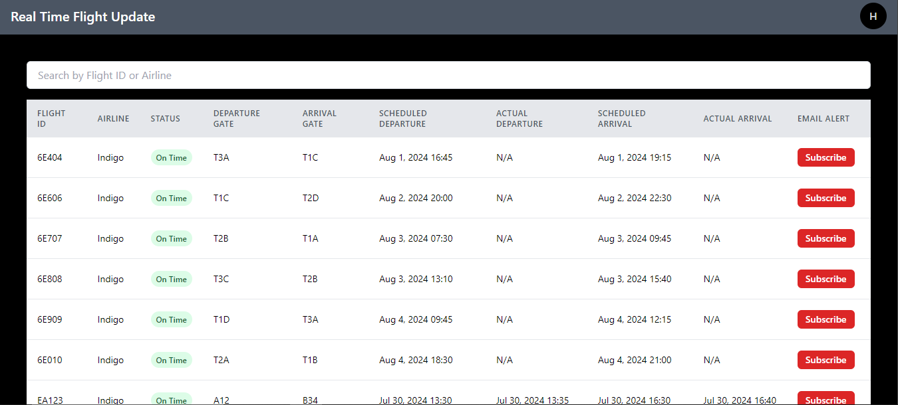
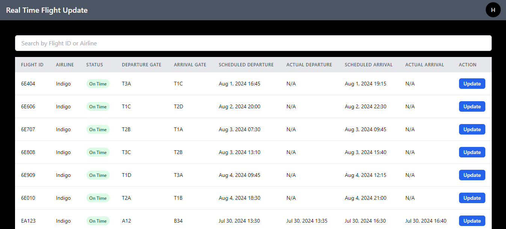
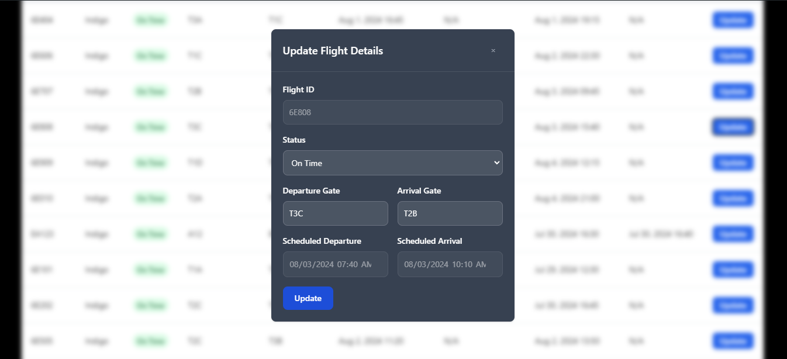
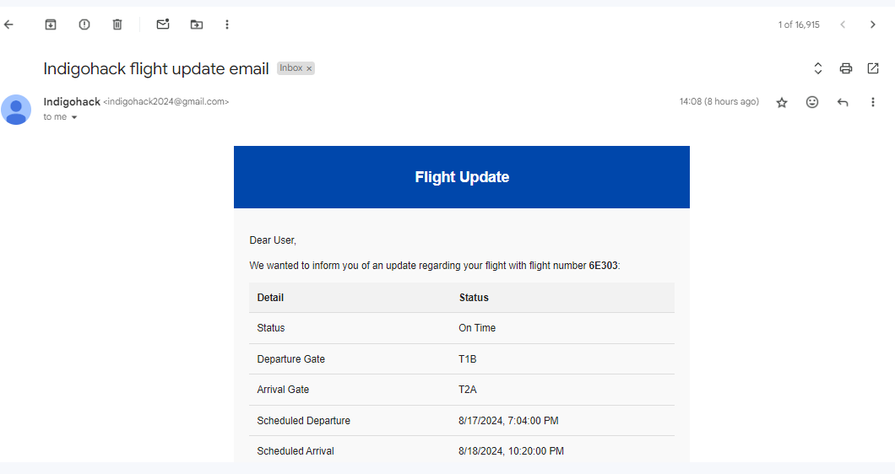

# Indigo Hack To Hire 2024 - Backend

This is the backend for the Indigo Hack To Hire 2024 project. It provides API endpoints for user authentication, flight information management, and email notification services.

## Table of Contents
- [Project Overview](#project-overview)
- [Key Features](#key-features)
- [Technologies Used](#technologies-used)
- [Installation](#installation)
- [Usage](#usage)
- [API Endpoints](#api-endpoints)
- [Project Screenshots](#project-screenshots)


## Project Overview

The backend is built using Node.js and Express.js, providing a robust and scalable server for the Indigo Hack To Hire 2024 application. It handles user authentication, flight data management, and email notifications for subscribed users.

## Key Features

- User authentication (sign in / sign up) with email
- OTP verification for new user registration
- CRUD operations for flight data
- Subscription management for flight updates
- Email queuing system using Kafka
- Email notifications using Nodemailer
- PostgressSQL for storing user, flight and notification data
  
## Technologies Used

- Node.js
- Express.js
- Postgres 
- Zod (for input validation)
- Kafka (for email queuing)
- Nodemailer (for sending emails)

## Installation

To set up the backend, follow these steps:

1. Clone the Repository
   ```
   git clone https://github.com/YourUsername/indigohack-backend.git
   cd indigohack-backend

2. Install Dependencies
Make sure you have Node.js and npm installed. Then run:
    ```
    npm install
3. Set up Environment Variables
Create a `.env` file in the root directory and add necessary environment variables:
    ```
    PGHOST = postgress_host
    PGDATABASE= postgress_database_name
    PGUSER= postgress_owner
    PGPASSWORD= postgress_password
    ENDPOINT_ID= postgress_endpint_ip
    EMAIL = Email_id (to send email from)
    EMAIL_PASSWORD = Email_password (app-password for gmail)
    JWT_SECRET = 'indigo-hack'
    KAFKA_BROKER = Kafka_broker
    KAFKA_PASSWORD = Kafka_password
    KAFKA_USERNAME = kafka_username/key
4. Start the Server
     ```
     npm start or node app.js
## Usage

After installation, the server will be running on `http://localhost:3000` (or the port you specified). Use API testing tools like Postman to interact with the endpoints.

## API Endpoints

- POST /api/v1/user/signup - Register a new user
- POST /api/v1/user/signin - Authenticate a user
- POST /api/v1/user/verify-otp - To verify otp
- GET /api/v1/flight - Get all flights
- Post /api/v1/flight/create - Add a new flight
- PUT /api/v1/flight/update/:id - Update flight details
- POST /api/v1/flight/subscribe - Subscribe to flight updates and push notification via mail
- POST /api/v1/flight/subscription/:id - To retreive subscription details of a user.
- GET api/v1/getme - To verify jwt

## Project Screenshots
- Signin page


- Signup page


- Otp verify page


- Dashboard page



- Admin Page



- Update flight information



- Update email screenshot



- Otp email screenshot


### Project Frontend
Github - https://github.com/Haarsh1306/indigohack-frontend
