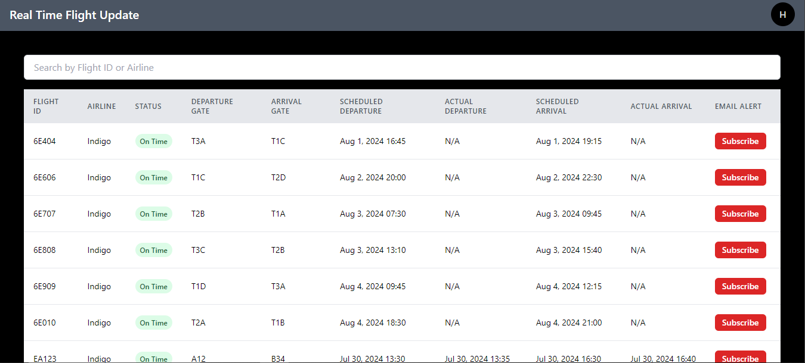
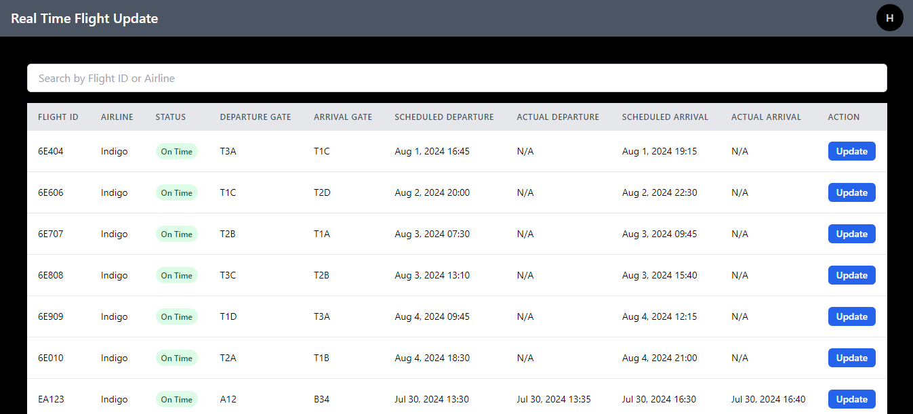
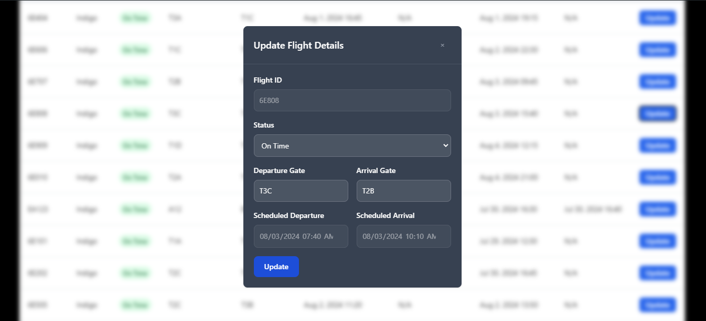
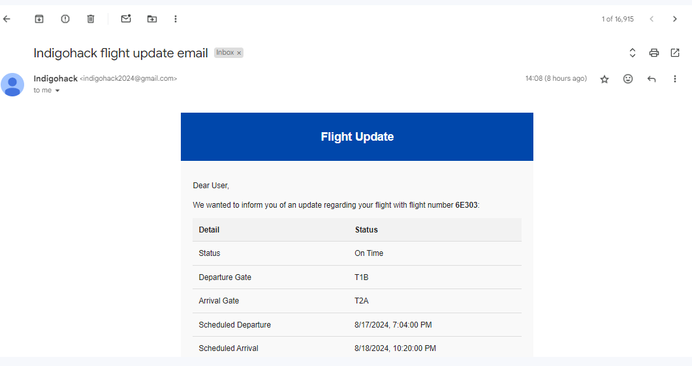
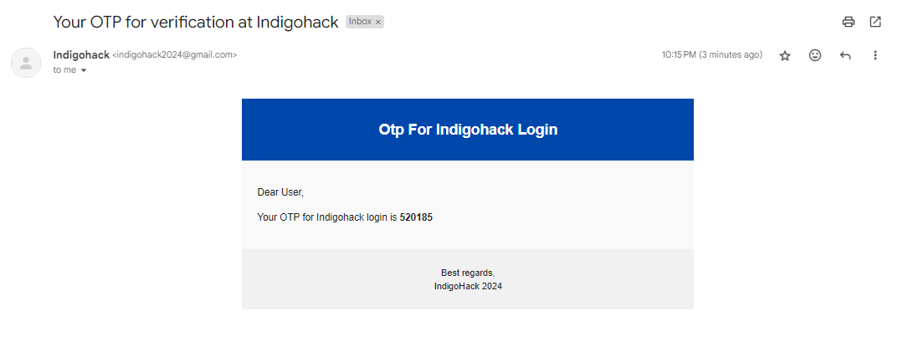

# Indigo Hack To Hire 2024 - Frontend

This is the frontend for the Indigo Hack To Hire 2024 project. Users can sign in/sign up using their email account, view flight information, and subscribe to email alerts for specific flights. When flight information changes, subscribed users receive email notifications with updated details.

## Table of Contents
- [Project Overview](#project-overview)
- [Key Features](#key-features)
- [Installation](#installation)
- [Usage](#usage)
- [Components](#components)
- [Routes](#routes)
- [Project Screenshots](#project-screenshots)


## Project Overview

The application frontend is built using React, Tailwind CSS, Redux and other modern web technologies. It provides a user-friendly interface for tracking flight statuses and subscribing to future updates.

## Key Features

- User authentication (sign in / sign up) with email
- View a table of flight data with various details
- Subscribe to email alerts for specific flights
- Admin functionality to update flight information
- Email notifications for subscribed users when flight information changes

## Installation

To get started with the project, follow these steps:

1. Clone the Repository
   ```
   git clone https://github.com/Haarsh1306/indigohack-frontend.git
   cd indigohack-frontend
2. Install Dependencies
   Make sure you have Node.js and npm installed. Then run:
   ```
   npm install
4. Start the Development Server
   ```
   npm run dev
## Usage

After installation, you can access the application through your web browser. Use the different routes to navigate through the application features.

## Components

- Table: Displays flight information in a tabular format. Users can view flight details and subscribe to flights.
- Update Flight Details: Allows admins to update flight information.

## Routes

- /signin - For existing users to log in
- /signup - For new users to register with OTP verification
- /dashboard - For users to view flight data and subscribe to notifications for any flight
- /admin - For updating and changing flight data to simulate notifications

## Project Screenshots
- Signin page


- Signup page


- Otp verify page


- Dashboard page



- Admin Page



- Update flight information




- Update email screenshot



- Otp email screenshot




### Project Backend
Github - https://github.com/Haarsh1306/indigohack-backend
